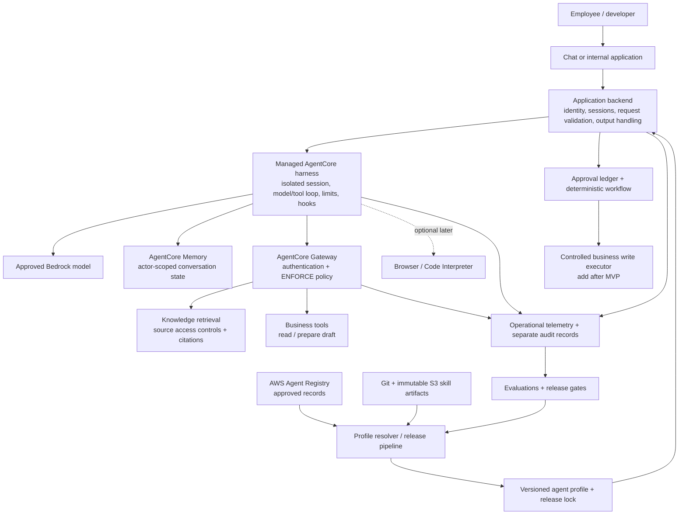

# Enterprise agent harness on AWS

**A development MVP for internal knowledge and business operations, with a defined path to production.**

Prepared 2 October 2026. Based on a downloaded snapshot of 577 official AgentCore developer-guide pages, the complete AWS guide PDF, supplemental API references, and five official GitHub repositories. AWS capabilities are cited below; architecture choices and thresholds are recommendations, not AWS guarantees.

## 1. Recommended starting point

Start with **the managed AgentCore harness**, one authenticated AgentCore Gateway, one development AWS Agent Registry, a small internal knowledge corpus, and a thin application backend. Use one agent profile, one approved model, two reviewed skills, read-only tools, and a draft-only business workflow.

The reusable foundation is the combination of the managed agent loop and your application's contracts for identity, sessions, skills, tools, releases, and approvals. New use cases should usually become a new profile, skill, or Gateway target. Add custom agent code only when the managed loop cannot express the behavior you need.

For this MVP, use synthetic or non-sensitive development documents and a sandbox business system. Establish request validation, resource-scoped permissions, bounded execution, Registry review, and repeatable evaluations immediately. Introduce corporate SSO, real document permissions, private networking, stronger retention controls, and operational ownership before production use.

**Provisional Region: `us-east-1`.** It is supported by the principal capabilities in the downloaded Region table, including the harness and Registry. Confirm model availability and deployment-time service support. No residency requirement or existing identity provider has been specified. [S01, S02, S03]

This repository includes a local, offline request-boundary starter, templates, and pinned sample references. The downloaded research archive also contains selected sample source. AWS infrastructure has not been provisioned, and live integration has not been verified in an AWS account.

## 2. Understand the pieces

| Piece | What it does | What your platform must add |
| --- | --- | --- |
| AgentCore harness | Managed Strands-powered model/tool loop; configuration for tools, skills, memory, environment, limits, hooks, and endpoints | Product behavior, validated requests, profiles, user/session binding, release rules |
| AgentCore Runtime | Hosts agent or MCP code; provides execution, scaling, authentication, and session isolation | Agent code, framework integration, tool adapters, instrumentation where needed |
| AWS Agent Registry | Catalogs approved agent, MCP, skill, and custom resource records; offers search, browsing, and an MCP discovery endpoint | Review criteria, artifact publishing, version resolution, permission checks, revocation handling |
| AgentCore Gateway | Connects APIs, Lambda functions, MCP servers, and supported connectors through a managed tool surface | Target onboarding, narrow tool contracts, backend data authorization |
| AgentCore Identity | Workload identity and outbound credentials; integrates with existing identity providers | User authentication design, consent, session mapping, scope selection |
| Policy in AgentCore | Authorizes Gateway actions and arguments; Cedar-compatible Dogwood adds temporal and guardrail conditions | Reviewed business rules, trustworthy claims, policy tests, authorization outside Gateway |
| Bedrock Guardrails | Content safeguards; can be applied at application/model boundaries and through supported Gateway policies | Correct coverage, thresholds, treatment of tool results, final-output handling |
| AgentCore Memory | Short-term conversation events and optional long-term extracted memory | Actor scoping, retention/deletion, provenance, decisions about what may be remembered |
| Knowledge retrieval | Bedrock Knowledge Bases or another retrieval service searches business documents | Ingestion, freshness, citations, source permissions, deletion propagation |
| Browser / Code Interpreter | Managed browser automation and isolated code execution | Tool-specific permissions, egress controls, approved dependencies and artifact handling |
| Observability / Evaluations | Execution traces, metrics, logs, quality scoring, ground truth and trajectory evaluation | SLOs, audit records, regression datasets, alert ownership and release thresholds |
| Optimization | Recommendations, immutable configuration bundles, and A/B testing | Controlled adoption, regression checks, promotion decisions |

The harness is a managed abstraction running on Runtime. It is not necessary to deploy a separate custom Runtime agent merely to use the harness. Registry records describe resources; they do not deploy those resources or grant access to their endpoints. Gateway is the tool access path. [S01–S04, S11, S17, S19]

The MCP endpoints also have different jobs: **Registry MCP discovers resources; Gateway MCP invokes configured tools; a Runtime-hosted MCP server implements tools.** A resource appearing in search does not automatically connect it to an agent.

## 3. Reference architecture



**Runtime plane:** the application's request path, harness session, model calls, memory, Gateway, and business systems.

**Control plane:** repositories, skill artifacts, Registry records, profile resolution, policies, evaluations, and release promotion. An employee chat request should not have control-plane permissions.

**Operations plane:** traces, costs, quality signals, alerts, incident controls, and durable action receipts. Keep identity, policy decisions, and business audit evidence distinct from model-generated explanations.

For later write operations, add an application-owned approval workflow and a deterministic business executor. The initial MVP stops at a prepared draft. The supplied starter prepares bounded invocation requests; it does not implement this entire architecture.

## 4. The concrete development MVP

Build three useful behaviors:

1. **Answer an internal question with citations.** Search a small, versioned corpus of policies and runbooks. Return source references and distinguish documented facts from uncertain conclusions.
2. **Summarize operational information.** Retrieve a sandbox ticket or status record and produce a structured summary and suggested next steps.
3. **Prepare a business-action draft.** Produce a proposed ticket update or request with exact fields and a preview. Store a draft in the application or return it to the user; do not modify a real business system.

Start with a single `internal_knowledge_ops` profile, one approved Bedrock model, and two skills: `knowledge-answering` and `operations-draft`. A skill supplies instructions and optional resources; it does not grant tool permissions.

| Component | Development MVP | Before production |
| --- | --- | --- |
| Application | Local developer client or small internal backend; text-only chat input | Corporate authentication, user authorization, throttling, restricted direct service access |
| Harness | Managed microVM-backed harness; fixed model and bounded loop | Named version-pinned endpoint, reviewed hooks, operational limits |
| Tools | Exact allowlist of retrieval and read-only sandbox tools | Protected writes, backend authorization, verified credential delegation |
| Knowledge | Non-sensitive development corpus shared by pilot users | Document-level ACL enforcement, freshness and deletion tests |
| Memory | Short-term conversation state with explicit actor/session mapping | Retention, deletion, custom-key needs, evaluated long-term memory |
| Registry | One IAM-authenticated dev Registry; manual review | Separate production catalog/release scope and publisher/curator separation |
| Skills | Reviewed local examples published into immutable S3 prefixes | Digest verification, dependency review, reproducible release artifacts |
| Policy | `ENFORCE`; permit only explicitly approved tool actions | User/role and argument restrictions; durable business constraints |
| Content controls | Prompt and retrieved-content boundary rules; output review on demo corpus | Enforced content/PII checks at the required model/application/tool boundaries |
| Operations | Traces, usage metrics, repeatable regression cases | SLOs, online quality sampling, audit retention and incident exercises |

Suggested starting limits are **12 iterations, 120 seconds per invocation, and `maxTokens = 4096`**, with short session idle/lifetime settings selected after observing cold starts and cost. These are tunable starting values. The API references disagree about invoke-time `maxTokens` scope; verify actual service behavior and keep an independent application usage ledger. None of these settings is a complete monetary budget. [S05, S07, S23, S24]

Use an exact `allowedTools` list. The harness exposes `shell` and `file_operations` by default if unrestricted. Exclude shell, browser, and code execution from this knowledge MVP. Validate which helper tool the managed skill loader needs and allow only that reviewed capability; avoid granting `@builtin` broadly. Do not grant the separate direct-command APIs to normal application callers. [S05, S08]

Start with short-term memory and no long-term extraction strategy. Select the setting explicitly: direct service API creation enables managed memory by default; the current AgentCore CLI defaults to memory disabled. Reusing a session gives conversational continuity, but it does not guarantee the same underlying microVM forever. [S02, S06]

For retrieval, prefer the native Gateway connector if using **Bedrock Managed Knowledge Bases**, where it fits the data and permissions model. That connector specifically supports the managed Knowledge Bases offering, not every legacy/custom Bedrock KB. Otherwise wrap the existing retrieval API with a small Lambda or MCP adapter. [S20]

## 5. What to build around the managed harness

### A. A strict application request boundary

Expose a narrow product API such as `message`, `conversationId`, and an approved `profileId`. Construct the `InvokeHarness` request on the server. The ordinary caller must not supply `model`, `systemPrompt`, `skills`, `tools`, `allowedTools`, provider URLs, `additionalParams`, `actorId`, or increased execution limits.

Derive the actor from the verified identity and scope the conversation to that actor and organization. Generate UUID sessions on the server; check ownership on every resume. Reject a different user's session, unknown message roles, unsolicited `toolUse` blocks, and inline results without an authenticated pending handoff. Keep user text, retrieved documents, and tool outputs in their own trust boundaries.

The harness validates request structure but AWS explicitly leaves semantic input validation and session-to-user mapping to customers. Model configuration can redirect requests or change credentials if freely forwarded. Per-invocation skills can also replace a same-named configured skill. Restrict callers so they cannot bypass the application by invoking the underlying resource directly with arbitrary overrides. [S08, S23]

The included CLI starter demonstrates this boundary and persistent session ownership for a trusted local developer. Its `--user` argument is a local label, not enterprise authentication.

### B. An agent profile and a release lock

An application profile ties together:

- Purpose, owner, environment, and permitted data classifications.
- Harness resource and named endpoint; approved model configuration.
- Skill artifact references, digests, and evaluation evidence.
- Gateway targets and exact model-facing tool names.
- Execution limits, memory choices, policy version evidence, and content-control configuration.
- Registry record IDs/revisions and promotion criteria.

Keep a **release lock** that records the resolved versions and artifact digests used by a deployment. AWS Registry records, harness versions, and configuration bundles help with parts of this problem, but they are not interchangeable.

Harness versions are immutable snapshots of configuration. A version containing an S3 URI or a Git URL can still load changed external content if that source is mutable. A remote MCP URL may also serve a changed schema. Pin skill contents and tool deployment/schema versions separately. [S03, S09, S10, S21]

### C. A tool onboarding contract

For each target record the owner, version, input/output schema, authentication mode, data classification, side effects, timeouts, retry rules, and quota expectations. Keep inputs narrow; avoid generic tools that accept arbitrary SQL, URLs, cloud actions, or shell commands when a business operation can be defined explicitly.

Separate `get_ticket`, `prepare_ticket_update`, and `commit_ticket_update`. The last operation belongs to a deterministic executor with permission checks and an action receipt. Validate schemas at both the Gateway contract and backend. Tool descriptions and MCP annotations help the model choose tools but do not authorize actions.

For user-scoped systems, verify the credential path. Harness inbound **SigV4 does not currently propagate per-user identity for Token Vault user-scoped OAuth or on-behalf-of exchange**. An application-assigned `actorId` scopes memory; it does not turn a shared IAM identity into delegated downstream user authority. Use the supported inbound OAuth/JWT path where that delegation is required. A dev service identity is acceptable only for data all pilot users may access. [S08, S12]

### D. Knowledge access enforcement

Keep authoritative knowledge retrieval separate from conversational memory. Store document source IDs, ACL metadata, versions, and ingestion times. Carry trusted user/group context into retrieval before passages reach the model. Verify that the source actually enforces the chosen ACL scheme; an agent-supplied metadata filter is insufficient.

The Managed Knowledge Bases Gateway connector passes `userContext` through but **does not derive it from the IAM caller**. Inject or overwrite that value from verified application identity in a trusted adapter/interceptor. Never let the model choose a different user ID. If the managed harness integration cannot carry the required context safely, use a dedicated retrieval adapter or move that agent to custom Runtime code. [S20]

A production ACL change must invalidate affected cached passages and access paths. Conversation history can retain content a user previously accessed; define when to redact/delete history or force a new session after permission changes. Hiding future retrieval results alone is not complete revocation.

## 6. Put AWS Agent Registry in the right role

**Use Registry as a reviewed catalog and a source of deployment candidates.** In the MVP, developers discover resources through Registry and the release pipeline selects a fixed set. Introduce agent-driven resource selection later, inside a profile's preauthorized envelope.

### Current service namespace

AWS launched the independent namespace on **6 August 2026**. New integrations use `agent-registry` and `agent-registry-control` SDK/CLI clients, `agent-registry:*` IAM actions, and `arn:aws:agent-registry:...` resource ARNs. Identity, Gateway, Runtime, harness, and Policy retain their own `bedrock-agentcore` namespaces.

The Registry discovery MCP endpoint is:

```text
https://agent-registry.<region>.api.aws/registry/<registryId>/mcp
```

The old Registry preview namespace shuts down on **30 October 2026**. A new project should start directly on the new namespace. Existing users need the full schema/data/configuration migration, not merely a string replacement. [S11, S14]

### Records and artifact storage

Current semantic record types are `AGENT`, `MCP`, `SKILL`, and `CUSTOM`. Descriptors carry MCP server information, A2A agent cards, skill definitions, or custom JSON. Record `name + recordVersion` is the deduplication key. A non-A2A harness can be registered as `AGENT` with a `custom` descriptor rather than a fabricated A2A card. [S13, S15]

Store actual skills and binaries in Git/S3/ECR/package repositories. Registry can retain skill markdown for discovery, but **does not store a skill's other files**. Avoid treating Registry as a package manager or execution engine. [S13]

Recommended flat custom metadata fields: `owner`, `environment`, `dataClassification`, `sideEffects`, `artifactUri`, `artifactDigest`, `evaluationEvidenceUri`, and `reviewedAt`. Keep arrays and nested dependency trees in a linked artifact manifest; the Registry custom-metadata schema supports a restricted flat set of string, enum, URI, and boolean fields.

Schema evolution is additive: saved fields cannot be removed/retyped. Requiring a new field can make an existing approved record non-compliant **without withdrawing its approval**. The promotion pipeline must check both approved revision and metadata compliance. [S16]

### Publication and resolution

1. Build and review the resource and its narrow permissions.
2. Publish its immutable artifact and capture its digest/schema version.
3. Create a Registry draft with owner, version, access information, and evidence.
4. Submit for review. A curator verifies suitability and approves.
5. Resolve the approved revision into the release lock and test it.
6. Publish a harness version and deliberately update the development or production endpoint.

The approval lifecycle is `DRAFT → PENDING_APPROVAL → APPROVED/REJECTED`; deprecation is terminal. Editing an approved record creates a new draft while the prior approved revision remains discoverable. Discovery indexing is eventually consistent, sometimes taking minutes. Synchronization from MCP/A2A endpoints is triggered explicitly; it is not guaranteed continuous schema synchronization. [S15, S18]

Use manual review in the MVP; the reviewed sample's new API expresses this as `approvalConfiguration: {autoApprovalRules: []}`. Avoid copying older README language such as `autoApproval: false` into current API payloads. [G01]

### Discovery is not authorization or revocation

Search ranking and metadata filters only select candidates. The runtime must still enforce endpoint permissions, Gateway policies, backend access checks, and the release allowlist. Approved code is not safe for every user or dataset.

Rejecting or deprecating a record removes discovery visibility, but an agent can retain an endpoint or an already loaded skill. Revoke at the execution boundary too: block the tool in Gateway/backend, remove the credential grant or allowed target, publish a restricted profile, and stop affected sessions when necessary. Use Registry lifecycle events to drive re-resolution and incident workflows, with an application emergency-deny control that does not wait for search indexing.

For production, restrict publishing, curation, and consumption to separate roles. Registry control-plane APIs always use IAM even when discovery is JWT-authenticated. Registry auth type and JWT discovery URL are immutable after creation, so choose them deliberately or create a new registry for a changed auth model. [S12, S15]

Organization sharing through AWS RAM is useful later. Its record-level creator/source-account conditions do not filter search/list enumeration. Use separate registries or explicitly restrict enumeration if catalog metadata itself must be isolated. [S25]

## 7. Policies, guardrails, approvals, and network controls

Treat these as independent controls with different enforcement points.

| Control | Enforcement point | Example |
| --- | --- | --- |
| Authentication | Product/backend and service ingress | Only an authenticated employee may start a conversation |
| Session ownership | Application session store | Employee A cannot resume Employee B's conversation |
| AWS permission | IAM, resource policies, permission boundaries/SCPs | Harness role can invoke only the chosen Gateway and model |
| Model-facing tool selection | Harness `allowedTools` | Offer only retrieval and sandbox ticket-read operations |
| Business authorization | Gateway Policy and backend | Read permitted records; writes require exact authorization |
| Content safeguards | Application/model and relevant Gateway request/response paths | Detect suspicious instructions and suppress sensitive output |
| Execution controls | Harness limits, rate limits, application budget ledger | Bounded loop and controlled request frequency |
| Human approval | Application/workflow plus deterministic executor | Commit only the approved payload once |
| Network restriction | VPC endpoints, egress rules, target reachability | Agent cannot reach unapproved external endpoints |
| Audit evidence | Application and business executor | Record actor, action digest, decision, and receipt |

Gateway policies use **default-deny and forbid-wins** semantics. Use `ENFORCE` for the actual read-only MVP permissions. `LOG_ONLY` is useful to tune a new rule against harmless replay traffic, but it permits requests even when a policy would deny them. A principal with `UpdateGateway` can change mode or remove the policy engine; restrict that control-plane permission. [S17]

Dogwood is compatible with Cedar and adds temporal conditions and guardrail information providers. Gateway policies can inspect supported request/response fields, including content safety checks. These guardrail scores are model-derived and can vary; deterministic policy evaluation does not make the underlying content classifier deterministic. `suppressOutput` cannot reverse an action that already executed. [S17, S22]

Gateway policy governs traffic that traverses Gateway. It does not cover arbitrary direct MCP connections, shell commands, code execution, model calls made outside the governed path, or external writes performed by an inline function. Apply the appropriate controls at each path or eliminate the bypass.

### Lifecycle hooks

Use synchronous Lambda `before_invocation` and `before_tool_call` hooks where additional validation is needed, with failure mode `deny` and short timeouts. Reject a truncated context if complete context is required for the decision. SNS and EventBridge hooks are notifications; they cannot block the loop. [S04]

An `after_tool_call` hook runs after the action. An `after_invocation` hook cannot retract streamed output. For strict final-output filtering, collect the assistant text in the backend, evaluate it, and release only approved output; alternatively implement a specifically tested safe streaming boundary. Do not expose raw model reasoning or full tool results by default.

Inline functions are useful for handing a request back to the application. Process an action only after the full stream reaches the appropriate final `tool_use` handoff. The after-tool event for a client-supplied result is not proof that a business action occurred; the executor must produce its own receipt. [S04, S05]

### Approval and action integrity

For later writes, store a pending action with the actor, target, canonical argument digest, originating run/profile version, expiry, and idempotency key. Present the exact preview. Verify the approver's authority, recheck current source permissions and policy, and commit that same payload once. Changing any material field invalidates approval. A model assertion such as `approved: true` is never approval evidence.

Temporal Gateway policies can enforce action sequencing and session-level counters when configured with a policy session. Validate session propagation for the exact architecture: the documented automatic multi-hop behavior is Gateway → Runtime → Gateway within one account and Region. Do not assume direct harness invocation establishes the same policy session. A 24-hour idle expiry is not a durable daily budget or transaction ledger. Use backend records for irreversible operations and concurrency-sensitive invariants. [S26]

### Private networking and data residency

Public networking with only development data is sufficient for the initial MVP. Before real internal data, decide private ingress, VPC egress, allowed external domains, regional model routes, and credential endpoints. PrivateLink ingress and VPC outbound connectivity are separate concerns.

A VPC harness needs private ECR API/DKR and S3 endpoints for its managed image, plus the necessary inference/AgentCore/logging endpoints. It does not inherently require NAT for the managed image pull. External Git/MCP/provider access still needs a permitted egress route. Gateway VPC egress has its own setup. [S08, S27]

Registry embedding inference may process prompts/results across **any commercial AWS Region**, although stored data stays in the primary Region. Do not put sensitive operational payloads in discovery queries; use capability descriptions. Review this documented behavior and model/evaluation cross-region routing before making a strict residency claim. [S28]

## 8. A general-purpose extension model

Create specialized profiles over shared platform contracts. A knowledge assistant needs retrieval; an operations agent needs status tools and approved actions; a research agent may need browser access; a coding agent may need filesystem/shell/code tools. Each profile receives only its required capabilities.

Use the AgentSkills format: `SKILL.md` frontmatter with name/description and optional `scripts/`, `references/`, and `assets/`. Keep instructions focused on task procedure. Load progressively rather than adding all skills to every prompt. Review skill scripts as executable software.

For release-pinned skills, prefer immutable S3 prefixes or image-baked paths. The documented native Git skill source exposes URL/path/auth but no commit/ref field; resolve a Git commit in CI and publish the reviewed contents to immutable S3. S3 bucket versioning alone is insufficient if the harness URI reads the current object. Deny mutation of released prefixes and keep digest evidence. [S09, S29]

For MCP integrations, register the server and tool schema, route enterprise actions through Gateway, and bind its version to the profile release. Support schema-change notifications/review and validate returned payloads. Runtime-hosted custom MCP servers are appropriate when existing APIs need a reusable tool wrapper; do not build a server for every simple Lambda-backed action.

For multi-agent work, introduce a coordinator only when independently scoped specialists improve measured results. Delegate explicit task contracts with smaller budgets and traceable user authority. A2A is a transport for compatible agent interfaces; it does not automatically give a discovered harness an A2A endpoint or solve authorization.

For deterministic workflows, use Step Functions or application orchestration. The managed harness does not offer arbitrary custom graph patterns or arbitrary framework selection. AWS supports export to editable Strands Python today; other export frameworks are described as coming soon. An export still needs inspection of generated notes, dependencies, hooks, and authorization behavior. [S02, S10]

## 9. What the GitHub examples actually provide

The reference package snapshots source at commit `4cd43c71c642ce2428a39c6b025a73b686c74f8f` of the official sample repository. Review covered source and READMEs; examples were not deployed or exercised against AWS.

| Starter | Usefulness | Decision |
| --- | --- | --- |
| Official harness getting started | Create/invoke loop, client helpers and session behavior | Use as the lifecycle reference; restrict its sample role and builtins |
| Harness execution limits | Working examples of iteration/time/token controls | Adapt into the MVP profile |
| Harness Gateway integration | Shows how a Gateway becomes a harness tool source | Reuse the integration shape; replace `NONE` auth and public demo target |
| Harness skills | Demonstrates richer artifacts and dependency needs | Use concepts; publish pinned skill content instead of installing on every session |
| Harness OAuth | Concrete authentication and downstream tool plumbing | Use when adding user-scoped systems; review its demo identity setup |
| Registry end to end | New namespace, publishing and governance persona checks | Use the current Python code; its README retains older record-type/API terminology |
| Registry admin approval | EventBridge and approval automation structure | Reuse event/review patterns later; omit its external notification integration from this setup |
| Registry dynamic skills | Demonstrates discovery, loading, and `SKILL` descriptors | Reference only initially; downloader installs packages and shell tools run on the local host |
| Runtime discovery and invocation | Dynamic specialist discovery pattern | Defer until static profile quality is established |
| Policy tool access / guardrails | Enforced access decisions and content checks | Reuse tested policy authoring patterns with your actual generated schema |
| CI/CD-gated evaluations | Authenticated MCP example and quality gates | Borrow regression/gate structure; do not adopt its entire deployed stack for the first MVP |
| CDK knowledge-base RAG agent | Broader retrieval/infrastructure example | Reference for custom Runtime escape path; heavier than the managed-harness MVP |

The current recommended tooling is **`aws/agentcore-cli`** (`@aws/agentcore`). The older Python `bedrock-agentcore-starter-toolkit` repository explicitly calls itself legacy and directs new projects to the newer CLI. Do not install both into the same command environment without checking the `agentcore` name collision. [G02, G05]

Strands is a useful custom-code fallback, not an additional dependency required to write the first managed harness client. AWS Agent Toolkit supplies AWS-building skills/MCP integrations; add specific reviewed capabilities if needed, rather than enabling every AWS skill for a business knowledge assistant. [G03, G04]

See `EXAMPLES-REVIEW.md` for direct links, the precise review scope, and inclusion decisions. Local upstream files are reference snapshots with original licensing, not the default execution path.

## 10. Delivery roadmap and exit criteria

Time estimates assume a small team, an available AWS dev account, and accessible data. They are planning ranges.

| Stage | Work | Exit criteria |
| --- | --- | --- |
| Local foundation — complete in this package | Source snapshots, architecture, examples, profiles, strict request builder and session ownership checks | Offline validation passes; request payloads are reproducible |
| Dev foundation — roughly 2–3 working days | Configure account/Region, deploy managed harness, Gateway, dev Registry and short-term memory | Harness invokes with bounded limits; resource scopes and default tool restrictions verified |
| Useful pilot — roughly 3–5 working days | Add development corpus, retrieval adapter/connector, two skills and sandbox operations reads | Citations, useful answers, draft-only workflow, correct session isolation |
| Promotion preparation — roughly 1–2 weeks | Add SSO, real source ACLs, protected actions if needed, content controls, release pipeline, telemetry and runbooks | Production gates below pass with named owners and recorded evidence |
| Further expansion | New profiles, tools, specialist agents and optimization experiments | Measured benefit without broadening unrelated permissions |

Recommended pilot dataset: **60 cases**: 25 knowledge/citation questions, 10 operational summaries, 10 draft-generation tasks, and 15 adversarial/authorization/limit cases. Use deterministic checks for access, side effects, tool sequencing, and schema validity; use LLM evaluation plus human sampling for groundedness and helpfulness. [S19]

Suggested promotion targets are zero unauthorized tool/backend access in the required negative suite, zero duplicate business writes in replay tests, all draft outputs conforming to schema, at least 90% successful grounded answers on the reviewed pilot set, and measured latency/cost within a budget you set after real pilot traffic. These are initial acceptance proposals, not service SLAs.

Before promotion, verify:

- Verified SSO identity maps to sessions, actors, and required downstream permissions.
- Retrieval and cached conversation content cannot cross the chosen access boundary.
- Gateway `ENFORCE`, exact tools, hook failures, and direct-command restrictions resist bypass tests.
- Writes require exact payload approval, idempotency, and durable business receipts.
- Harness versions, skill artifacts, tool schemas, and policy evidence are pinned in a release lock.
- Production uses a named endpoint. `DEFAULT` tracks the newest harness version automatically.
- Trace logging and content retention are appropriate for the data; business audit evidence is durable.
- Stop-session, tool revocation, credential revocation, rollback, and recovery exercises succeed.
- Owners have agreed error/latency objectives, support escalation, spend limits, and on-call handling.

The detailed task list and dependency order are in `MVP-BACKLOG.md`. The enforcement mapping is in `CONTROL-MATRIX.csv`.

## 11. Operations, cost, and resilience

Harness traces are automatic, but CloudWatch Transaction Search needs one-time account setup. Record application run IDs alongside the harness/session/actor, tool action, profile release, policy decision, token usage, latency, and errors. Correlation headers are telemetry, not authorization claims. Configure log/trace retention explicitly; do not promise redaction without verifying the emitted payloads. [S07, S08]

Enable the required CloudTrail data events. Harness data-plane events use underlying Runtime event names and ARNs; monitor those instead of expecting a harness-specific resource/event for every operation. Registry uses the independent service namespace for current eventing and audit integrations. [S07, S14]

Monthly cost is the sum of model inference, Runtime CPU and memory, Gateway/discovery/policy operations, Memory events/storage/retrieval, knowledge ingestion/retrieval, optional browser/code sessions, evaluations, CloudWatch, storage, and networking. There is no separate harness charge. Do not estimate a fixed total before measuring model turns, context sizes, tool counts, session memory lifetime, and concurrency. [S07, S30]

Runtime CPU consumption can pause while awaiting model/tool I/O if no background CPU work occurs; memory remains billable while sessions run. Narrow tool definitions and progressive skill loading reduce repeated model input. An output-token cap does not cap input tokens or all AWS costs. Use daily application quotas and AWS billing alarms as complementary controls; billing alarms are not hard immediate spend stops.

Use short request timeouts and bounded retries. Read-only tool calls may be retried according to their contracts; write calls require idempotency and a checked action receipt. Treat client disconnection separately from stopping a Runtime session; provide a cancellation path and verify actual behavior.

For early resilience, version infrastructure and release artifacts, keep a last known good endpoint target, and rehearse restoring the development service. Production RTO/RPO and any regional failover need deliberate design. A second Region requires separately deployed resources, data/access decisions, and verified credentials and model availability; do not assume every AgentCore component or active session fails over automatically.

## 12. Decisions to revisit and documentation gaps

Decisions intentionally left open: corporate IdP, real knowledge source, business system, approved model, monetary budget, data retention, RTO/RPO, and production Region/account structure. None blocks the offline package; each affects live integration.

The downloaded docs contain several inconsistencies that should be checked during implementation:

1. The service Region table and Registry cross-region page list five Registry Regions, while a release-note paragraph says nine. The plan chooses a Region listed by both detailed sources.
2. The harness web-search walkthrough says `us-east-1` only; the main Region table lists additional web-search Regions. Web search is optional here.
3. `CreateHarness` documents `maxTokens` as aggregate output tokens per invocation; `InvokeHarness` describes generated tokens per iteration. The harness operations page describes an invocation budget. Validate the service behavior before relying on invoke-time limits for spend.
4. The skills guide says invocation skills append and same-name invocation skills win; the invoke API summary calls the field an override. For ordinary callers this field is excluded entirely.
5. Registry search prose says latest revision approved, while the dedicated lifecycle page documents an older approved revision remaining discoverable during editing. Resolve against the explicit revision lifecycle and test the returned revision.
6. Some sample READMEs describe the old Registry record model while their Python source already uses the new namespace/schema. Follow current service schemas and code-level verification.

## 13. Official sources and reading order

Read S02, S03, S08, S11, S17, S20, and S19 first. Every developer-guide page is available offline under `sources/html/` and `sources/text/`; download manifests include URLs, timestamps, byte counts, and SHA-256 hashes. Supplemental references and GitHub snapshots have their own manifests.

- **S01** [AgentCore overview](https://docs.aws.amazon.com/bedrock-agentcore/latest/devguide/what-is-bedrock-agentcore.html)
- **S02** [Managed harness](https://docs.aws.amazon.com/bedrock-agentcore/latest/devguide/harness.html)
- **S03** [Harness versus Runtime](https://docs.aws.amazon.com/bedrock-agentcore/latest/devguide/harness-vs-runtime.html)
- **S04** [Lifecycle hooks](https://docs.aws.amazon.com/bedrock-agentcore/latest/devguide/harness-lifecycle-hooks.html)
- **S05** [Harness tools and allowlists](https://docs.aws.amazon.com/bedrock-agentcore/latest/devguide/harness-tools.html)
- **S06** [Harness memory](https://docs.aws.amazon.com/bedrock-agentcore/latest/devguide/harness-memory.html)
- **S07** [Observability and cost controls](https://docs.aws.amazon.com/bedrock-agentcore/latest/devguide/harness-operations.html)
- **S08** [Harness security and shared responsibility](https://docs.aws.amazon.com/bedrock-agentcore/latest/devguide/harness-security.html)
- **S09** [Harness skills](https://docs.aws.amazon.com/bedrock-agentcore/latest/devguide/harness-skills.html)
- **S10** [Export harness to code](https://docs.aws.amazon.com/bedrock-agentcore/latest/devguide/harness-export.html)
- **S11** [AWS Agent Registry](https://docs.aws.amazon.com/bedrock-agentcore/latest/devguide/registry.html)
- **S12** [Registry inbound authorization](https://docs.aws.amazon.com/bedrock-agentcore/latest/devguide/registry-supported-auth-types.html)
- **S13** [Record types and descriptors](https://docs.aws.amazon.com/bedrock-agentcore/latest/devguide/registry-supported-record-types.html)
- **S14** [Registry namespace migration](https://docs.aws.amazon.com/bedrock-agentcore/latest/devguide/registry-faq.html)
- **S15** [Registry record lifecycle](https://docs.aws.amazon.com/bedrock-agentcore/latest/devguide/registry-record-lifecycle.html)
- **S16** [Custom metadata schema](https://docs.aws.amazon.com/bedrock-agentcore/latest/devguide/registry-custom-metadata-schema.html)
- **S17** [Policy core concepts](https://docs.aws.amazon.com/bedrock-agentcore/latest/devguide/policy-core-concepts.html), [enforcement modes](https://docs.aws.amazon.com/bedrock-agentcore/latest/devguide/policy-enforcement-modes.html), and [limitations](https://docs.aws.amazon.com/bedrock-agentcore/latest/devguide/policy-limitations-section.html)
- **S18** [Registry synchronization](https://docs.aws.amazon.com/bedrock-agentcore/latest/devguide/registry-sync-records.html) and [discovery consistency](https://docs.aws.amazon.com/bedrock-agentcore/latest/devguide/registry-search-records.html)
- **S19** [Evaluations](https://docs.aws.amazon.com/bedrock-agentcore/latest/devguide/evaluations.html) and [ground truth](https://docs.aws.amazon.com/bedrock-agentcore/latest/devguide/ground-truth-evaluations.html)
- **S20** [Managed Knowledge Bases Gateway connector and access filtering](https://docs.aws.amazon.com/bedrock-agentcore/latest/devguide/gateway-target-connector-managed-kb.html)
- **S21** [Harness versioning](https://docs.aws.amazon.com/bedrock-agentcore/latest/devguide/harness-versioning.html) and [configuration bundles](https://docs.aws.amazon.com/bedrock-agentcore/latest/devguide/configuration-bundles.html)
- **S22** [Guardrails in policies](https://docs.aws.amazon.com/bedrock-agentcore/latest/devguide/policy-guardrails-in-policies.html) and [Bedrock Guardrails](https://docs.aws.amazon.com/bedrock/latest/userguide/guardrails.html)
- **S23** [InvokeHarness API](https://docs.aws.amazon.com/bedrock-agentcore/latest/APIReference/API_InvokeHarness.html)
- **S24** [CreateHarness API](https://docs.aws.amazon.com/bedrock-agentcore-control/latest/APIReference/API_CreateHarness.html)
- **S25** [Cross-account Registry sharing](https://docs.aws.amazon.com/bedrock-agentcore/latest/devguide/registry-cross-account-sharing.html)
- **S26** [Policy sessions and identity propagation](https://docs.aws.amazon.com/bedrock-agentcore/latest/devguide/policy-session-based-temporal.html)
- **S27** [VPC and PrivateLink](https://docs.aws.amazon.com/bedrock-agentcore/latest/devguide/vpc.html), [Gateway VPC egress](https://docs.aws.amazon.com/bedrock-agentcore/latest/devguide/gateway-vpc-egress.html), and [supported Regions](https://docs.aws.amazon.com/bedrock-agentcore/latest/devguide/agentcore-regions.html)
- **S28** [Registry cross-region inference](https://docs.aws.amazon.com/bedrock-agentcore/latest/devguide/registry-cross-region-inference.html)
- **S29** [Native Git skill source API](https://docs.aws.amazon.com/bedrock-agentcore-control/latest/APIReference/API_HarnessSkillGitSource.html)
- **S30** [AgentCore pricing](https://aws.amazon.com/bedrock/agentcore/pricing/)
- **G01** [Official AgentCore samples](https://github.com/awslabs/amazon-bedrock-agentcore-samples/tree/4cd43c71c642ce2428a39c6b025a73b686c74f8f)
- **G02** [AgentCore CLI](https://github.com/aws/agentcore-cli/tree/be072a380434bbf1dae6ba23739eb2d1c0fb6220)
- **G03** [Strands Python SDK and harness](https://github.com/strands-agents/sdk-python/tree/563f57d7a387931760a2c3106014cd7c0db4c9bc)
- **G04** [AWS Agent Toolkit](https://github.com/aws/agent-toolkit-for-aws/tree/acc890da1028c9c9e7c4d496238789d4d77f201d)
- **G05** [Legacy Python starter toolkit notice](https://github.com/aws/bedrock-agentcore-starter-toolkit/tree/c5e1e2eba27ba431fb4895603e38022c420214bd)
