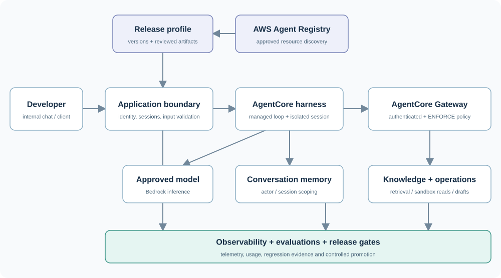

# Enterprise agent harness on AWS

A general-purpose AgentCore foundation, starting with an **internal knowledge and business operations assistant in development**. The design combines a managed AgentCore harness, authenticated Gateway, reviewed Agent Registry, skills, policies, and an application boundary. New capabilities can become reviewed profiles, skills, or tool integrations.

**Current state:** the architecture, templates, and offline development client are ready to review. AWS infrastructure has not been deployed. The client supports non-sensitive development data; production controls and live acceptance checks are tracked explicitly.



## Start reviewing

| Read | Purpose |
| --- | --- |
| [Architecture and implementation plan](ENTERPRISE-HARNESS-PLAN.md) | How the AWS services fit together, MVP choices, and production requirements |
| [Printable plan](ENTERPRISE-HARNESS-PLAN.pdf) | 14-page report for sharing and review |
| [GitHub examples review](EXAMPLES-REVIEW.md) | Which official starters to adapt, with pinned source links and compatibility findings |
| [MVP backlog](MVP-BACKLOG.md) | Development deployment tasks and promotion gates |
| [Control matrix](CONTROL-MATRIX.csv) | Responsibilities, enforcement points, and evidence needed before production |
| [Starter instructions](starter/README.md) | Offline request preparation and optional invocation of an existing harness |
| [Blueprints](blueprints/README.md) | Harness, hooks, Registry, skills, release contract, and policy templates |
| [Verification](VERIFICATION.md) | What has been checked and what requires a real AWS account |
| [Source inventory](sources/README.md) | Official documentation URLs, download hashes, and pinned example commits |

## Run the development starter

Use Python 3.10+ from the repository root. Python 3.12 is used in CI.

```bash
python -m venv .venv
.venv/bin/python -m pip install -r requirements.lock.txt
.venv/bin/python starter/harness_client.py validate
.venv/bin/python -m unittest discover -s starter -v
.venv/bin/python scripts/verify_blueprints.py
.venv/bin/python starter/harness_client.py prepare --user alice --message "Summarize the development runbook and cite sources."
```

On Windows, use `.venv\Scripts\python.exe` in place of `.venv/bin/python`. The commands above make **zero AWS calls**. `prepare` builds a bounded request and stores session ownership in local, git-ignored SQLite state. The local developer label is not corporate authentication.

The starter rejects caller configuration overrides, broad execution tools, production profiles, and business writes. It accepts text-only requests and buffers live output until a normal completion. These checks form a small application boundary; they do not implement SSO, knowledge-source permissions, content filtering, or a business approval executor.

## Connect AWS next

Follow [the deployment backlog](MVP-BACKLOG.md) and [starter setup steps](starter/README.md). Choose a development account, confirm the Region/model, provision scoped roles and services, validate the real Gateway schema and policy, publish immutable skills, and create a named `DEV` harness endpoint. Replace all template references and illustrative tool names.

The initial workflow answers questions, summarizes sandbox operations data, and prepares drafts. Business writes remain disabled. Promotion adds verified user identity, knowledge ACL enforcement, credential delegation where needed, content controls, approved action execution, audit evidence, and recovery exercises.

Registry is the reviewed catalog; it does not deploy resources or grant endpoint access. Gateway policies govern tools routed through Gateway. Skills supply instructions and do not grant permissions. Those distinctions guide how extensions are reviewed and released.

## Documentation and examples

Research was collected on **2 October 2026**: 577 official guide pages, six supplemental references, the full AWS guide PDF, five official GitHub repositories, and 304 selected upstream source/license files. This repository stores the authored plan, starter, templates, source manifests, and pinned example inventory. Large downloaded documentation and upstream source remain outside Git history.

To retrieve the reviewed examples without executing them:

```bash
python scripts/download_examples.py
```

They are saved under git-ignored `examples/upstream/`, with upstream licensing preserved. See [the source inventory](sources/README.md) for the official PDF and guide downloader. AWS documentation URLs are mutable; a fresh download can differ from the research snapshot.

The self-contained HTML report is [available here](ENTERPRISE-HARNESS-PLAN.html). Install `requirements-render.lock.txt` and run `scripts/render_report.py` to regenerate the HTML, SVG, and PDF; the renderer needs DejaVu fonts. Offline GitHub Actions checks validate the client and AWS template shapes without credentials or provisioning resources.
